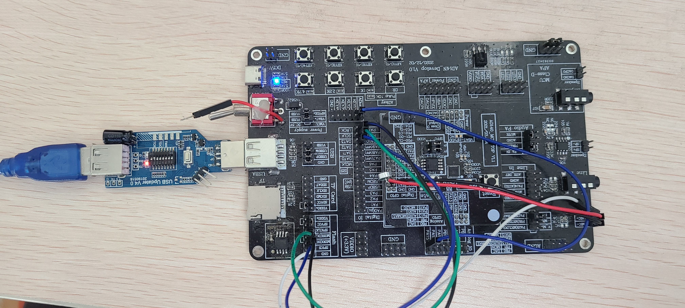
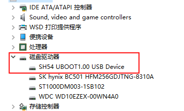
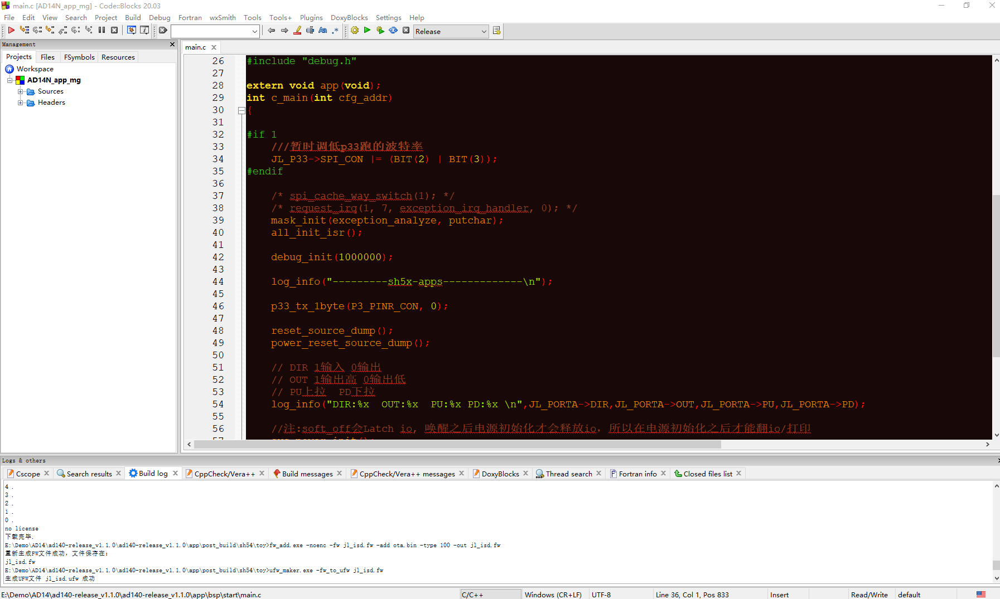
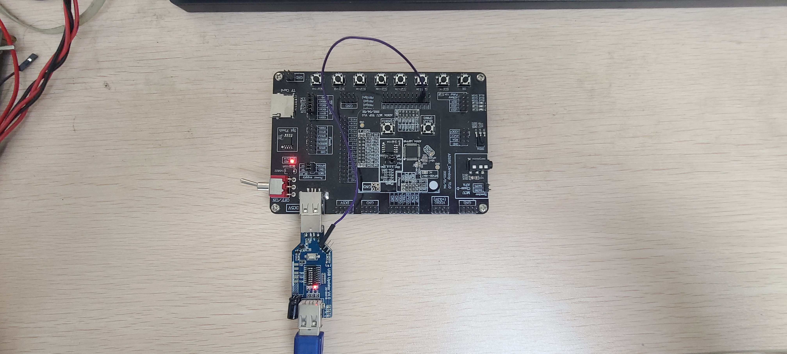
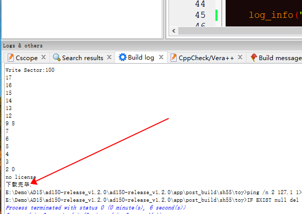
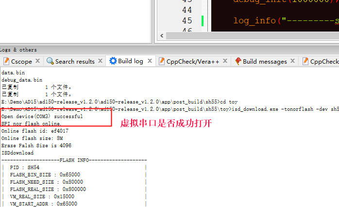
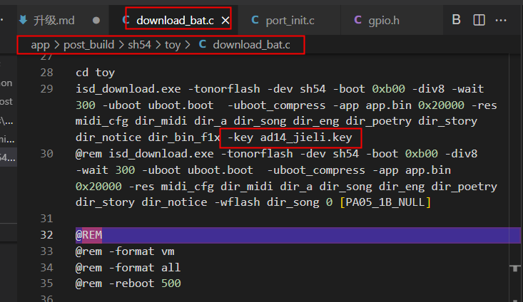
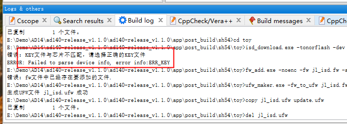

# AD系列下载程序说明

 新手请先仔细阅读SDK压缩包目录下的DOC文件夹里面的SDK手册和芯片手册!!!  
 
 开发中遇到任何问题请先到 <https://gitee.com/Jieli-Tech/fw-AD15N/issues> 查找是否有相关或类似问题的解决办法 !!! 
 
 

# 
# 一、下载程序操作说明
关于开发环境说明可以参考这个文档
<https://gitee.com/jieli-tech_fae/IOT-AC630N/blob/master/doc/software/%E5%85%A5%E9%97%A8/%E5%BC%80%E5%8F%91%E7%8E%AF%E5%A2%83.md>
## AD14:
1.准备好V4.0升级工具，2档搬上去，按图连接。 

 
 
2.波动了升级工具上面的开关以后需要拔掉再插才能生效。先按下升级工具上的按键再插上板子的USB接口，如果正常连上工具上的蓝灯会灭掉，可以在设备管理器中查看有没有SH54这个盘符出来。

 
如果蓝灯没有灭，或者设备管理器中没有出现这个盘符说明没有连上请按上面问题分析里面查找问题原因。
 
 
3.在CodeBlocks工程界面按 **‘F7’** 程序会开始编译，如果编译没有错误就会自动开始下载到目标板子，如图如果在下面小窗口看到计数倒数而且有下载完毕的提示表示下载成功。
 
如果没有出现下载成功的提示，先看有没有编译错误，然后看小窗口里面的提示一般没有成功都会有相应的报错提醒的。
 
 
 
 
## AD15:
1.**AD15使用串口下载** 需要安装杰理虚拟串口工具，去网盘下载虚拟串口工具驱动和相关使用说明。
链接：<https://pan.baidu.com/s/1GjcDVdMasCfSK7-IfndcPA>
提取码：8888

2.如图连接开发板或者目标板，注意串口都是接在芯片 PB9 管脚上，升级工具挡位**需要把2和7拨上去**。

3.在CodeBlocks工程界面按 **‘F7’** 程序会开始编译，如果编译没有错误就会自动开始下载到目标板子。如图如果在下面小窗口看到计数倒数而且有下载完毕的提示表示下载成功。
 
 
如果没有成功,确认下虚拟串口是否成功打开,如果没有请确认前面的虚拟串口安装是否成功或者串口被其他串口工具占用。
 
 
 
## 芯片KEY文件和程序KEY文件必须匹配,程序加KEY方法如图。

  
如果不匹配会报错这样的错误
 

# 二、开发板连不上怎么办
## AD14:
1.看有没有弹出SH54的盘符。

2.检查电源是否断开，工具会把供电断开使芯片芯片复位以后通信进入升级模式（注意必须要芯片可以复位），如果板子上本身有供电芯片无法复位可能会出现连不上的情况。

3.检测 电源 DM DP 地 这4根线是否接好。

4.升级工具检查更新到最新版本。工具地址-<http://pkgman.jieliapp.com/doc/all>

5.检查硬件连接和PCB图。

6.如果要下载到外挂FLASH参考SDK说明里面需要做对应修改。<https://gitee.com/Jieli-Tech/fw-AD15N/issues/I4T3EG>

## AD15:
1.AD15是用串口通信升级不是其他系列芯片的USB升级。需要注意有些芯片可能没有经过烧录器频偏较大导致串口通信出错，需要先用1拖2烧录器校准时钟以后再用工具下载程序。升级程序的时候不要用电池给芯片供电让升级工具来供电，升级工具会自动控制5V输出来复位芯片然后握手连接目标板上的芯片，如果电池一直供电会导致目标板上的芯片无法复位而连接不上。

3.注意如果当前目标板上的芯片工作在poweroff或者powerdown状态可能会因为工作电流太小，升级工具断电时间比较短板子上的电没放完芯片没有复位导致连接不上。

3.同上AD14的456点检查确认。

注意：下载升级的问题与目标板上的芯片里面的软件没有关系，只要按上面步骤检查即可。
 
 
 