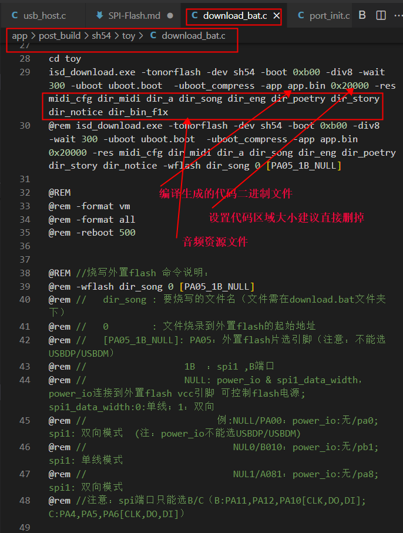
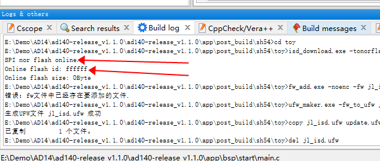
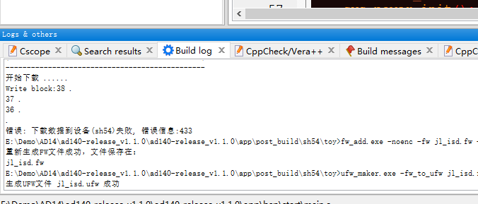
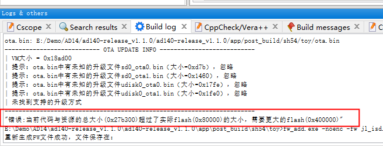
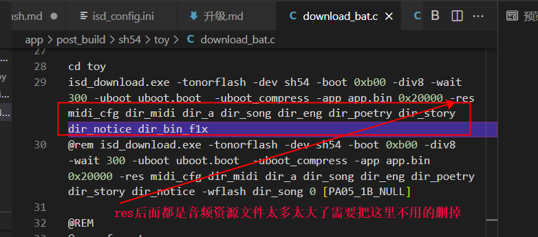
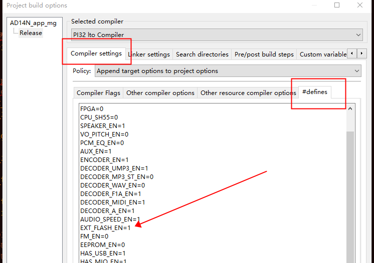
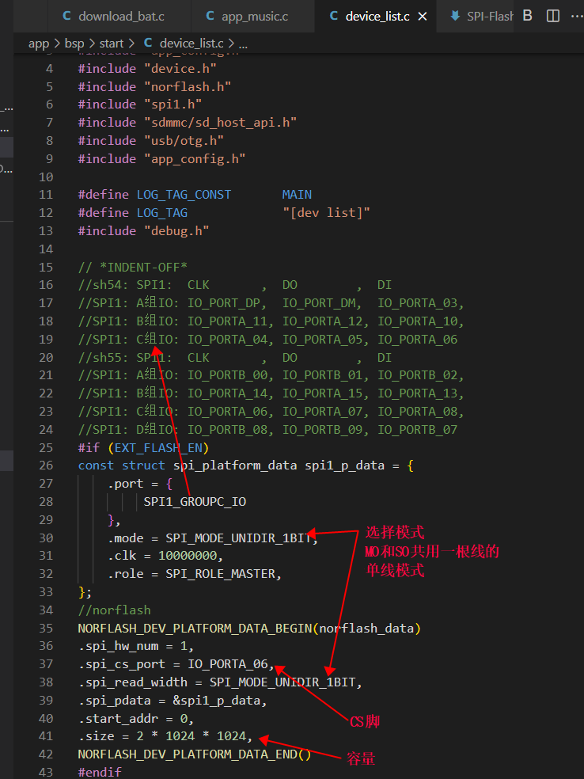
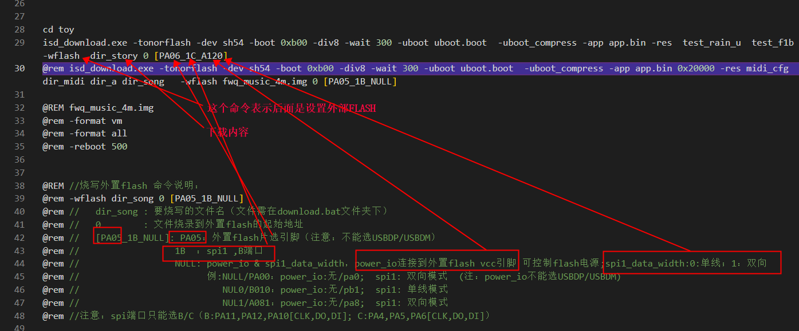
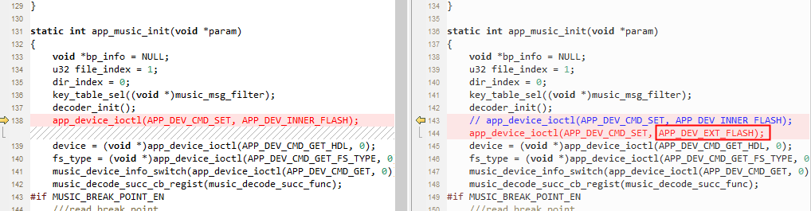
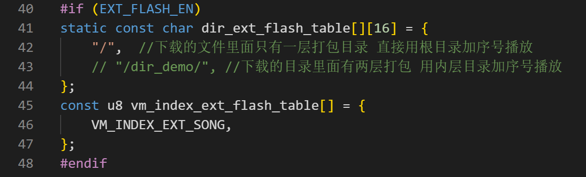

# SPI-Flash相关说明

 新手请先仔细阅读SDK压缩包目录下的DOC文件夹里面的SDK手册和芯片手册!!!  
 
 开发中遇到任何问题请先到 <https://gitee.com/Jieli-Tech/fw-AD15N/issues> 查找是否有相关或类似问题的解决办法 !!! 
 
 

AD系列芯片按内部有没有封装FLASH分成两种，一种内部有FLASH芯片丝印后缀是xxxA2(256K Byte)或者xxxA4(512k Byte)，另外一种是内部没有FLASH(xxxA0)。外接的FLASH分成两种，一种是A0芯片必须外接一个FLASH用来存放代码和少量资源文件，另外一种是非存放程序的FLASH用来存储音频资源文件(A2或者A4芯片的外挂FLASH，或者是A0芯片外接两个FLASH一个存放程序一个专门存音频)。
 
## 一、存放程序的flash
这里说的是A2或者A4芯片的内部flash或者A0芯片的SPI0。按图片中的路径找到控制下载的download_bat.c文件。

### 常见问题1
A0芯片SPI0没有读到，会出现设备可以正常连上但是下载的时候提示flash id全是F。需要找到isd_config.ini文件里面的SPI接线模式修改成SPI=0_3_0; 

### 常见问题2
下载计数到一半失败了，没有提示下载完成。可能是因为线路接触不好或者FLASH部分区域损坏。

### 常见问题3
提示需要更大的flash。下载的资源文件太大flash太小，必须删除一些资源。

 
 
删除方法如图

 
 
 

## 二、存放音频资源的flash
A2或者A4芯片的外挂FLASH或者A0芯片的SPI1，只用来存放音频资源。
### 1.需要在工程设置里面打开EXflash
 

### 2.在device_list.c里面配置flash的设置选项
 

### 3.批处理里面下载外挂flash资源
 

### 4.程序里面设置播放外部FLASH的内容
 

### 5.注意播放播放路径
 