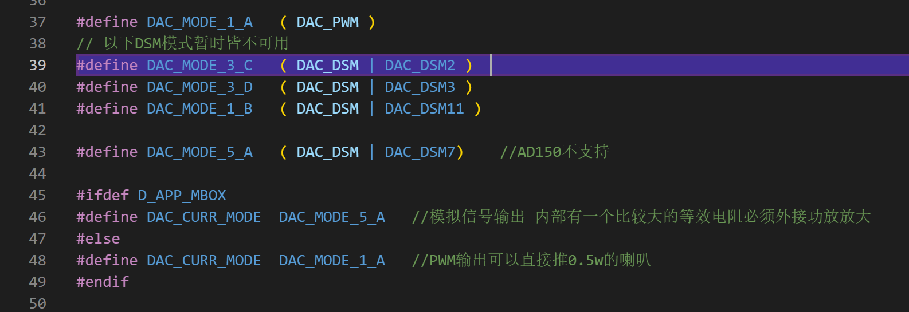

AD系列SDK功能简介
================

 新手请先仔细阅读SDK压缩包目录下的DOC文件夹里面的SDK手册和芯片手册!!!  
 
 开发中遇到任何问题请先到 <https://gitee.com/Jieli-Tech/fw-AD15N/issues> 查找是否有相关或类似问题的解决办法 !!! 
 
 

# 发布的SDK包里面包含2个工程(网上发布的有3个)分别适用于不同领域

* 玩具类应用 xxx_app_mg.cbp 
* 实例类应用 xxx_simple.cbp
* 通用MCU应用 xxx_app_mg.cbp
 
 不管哪个SDK工程里面都有一些已经做好的功能模块没有加上去，如果发现需要用到的功能工程里面没有建议用
其他代码编辑器查找一下是否有相关问题  
 
 

# SDK基本架构 参考《AD14N 15N AC104N SDK手册》 第七章内容

# GPIO
IO相关有三组IO寄存器
JL_PORTA 
JL_PORTB 
JL_PORTD 
分别是
    __RW __u16 OUT;     // 输出高低 0低   1高 
    __RW __u16 IN;      //输入电平读取   
    __RW __u16 DIR;     //输入输出 0输出  1输入 
    __RW __u16 DIE;     //数字模拟 0模拟  1数字 
    __RW __u16 PU;      //上拉控制  
    __RW __u16 PD;      //下拉控制 
    __RW __u16 HD0;     //强驱bit(0) 
    __RW __u16 HD1;     //强驱bit(1) 
    __RW __u16 DIEH;    // 
    参考：JL_PORTA->DIR &= ~BIT(0);   PA0设置输出 
IO相关问题排查
* 1.打印出IO相关寄存器看跟自己设置的是否一致
* 2.如果打印出来跟设置的不一致从设置开始写一个while(1)一行一行卡，看到底是在那里被改掉了
* 3.默认SDK里面芯片默认的一些外设可能会占用一些IO需要注意

# 串口调试
芯片没有单步和断点调试功能，只能使用串口打印LOG的方式来调试程序，一般用以下几种方法来DEBUG。
* 在关注的地方加上一些打印芯片在串口助手上看有没有打印出刚才加的类容
* 打印出关键参数的值来判断
* 在某些地方加一个while(1)来卡住程序，达到断点调试的目的
 

串口打印初始化
 
SDK里面做好了把串口打印映射到任意IO的功能（注意这个功能是否在其他地方被其他功能占用）
 

# 音乐模式
SDK开机默认进入音乐播放模式，细节会在这里有详细说明-[ _链接音乐播放详细介绍 ][音乐播放超链]
 

# 录音模式
AD14默认录音到内部FALSH里面自动分配的区域，AC104默认录音到U盘或者TF卡，也可以录音到外部FALSH（[ _链接AC104flash录音参考 ][104录音参考代码]）提取码:8wr0 
AD15没有LADC做不了录音功能。 

下面是AD14录音模式说明（这个录音也可以搬到AC104）
录音模式初始化，会设置采样率 录音存储设备 录音文件格式 文件比特率（在对应格式的编码api文件里面）

 
播放录音必须先停止录音才可以播放

 
录音文件可以用变调的方式播放出来，只需要在解码类型里面打开SPEED功能即可 

 
录音变调播放加上MIC能量自动检测就可以变成魔音功能细节可以参考demo[_链接魔音功能参考][魔音参考超链] 提取码:3n03 

# 混响音效
AC014 SDK默认有混响模式，提供了一些特殊音效可以做试试变声功能。 
可以在播放过程中实时切换不同的音效[ _链接AD14音效使用说明 ][超链AD14音效] 
AD14 添加变声模式参考代码 [ _超链AD14 ][AD14变调模式] 提取码:1ww0 

进入混响模式以后可以设置一些音效，只需要在这里打开对应的功能，加上对应的库文件即可。

# midi功能
SDK有一个midi播放模式
 
关于midi的详细说明参考文档[ _链接MIDI详细说明 ][midi说明超链] 提取码:vn4u 

# 支持在音乐文件中插入MARK点-即SDK里面的MIO功能
关于MIO功能需要配合杰里专用的工具来使用。 
1. 在工具里面设置需要的IO或者PWM波形（MIO工具有详细使用说明）
2. 程序里面设置对应的IO口

# 音量调节

 

如果觉得最大调到最大音量的声音还是不够大，可以把DAC里面的数据直接按比例放大，但是要注意这样可能会导致声音市镇。

 

# LADC和DAC中断
 
需要做LADC采样的应用都会跑到LADC中断里面，比如MIC录音 linein等功能。

 

所有播出声音的应用都会跑到DAC中断里面

 AD14 AC104可以选择不同的DAC输出方式 1.模拟信号输出 2.PWM数字功放输出  

# SDK默认按键驱动
SDK里面默认做好了AD按键 红外按键 IO按键 触摸按键 矩阵按键的驱动只要打开对应的宏设置相应的IO口就可以了
 
 

# 低功耗
程序里面做好了两种低功耗处理
1. poweroff 软关机 功耗大概不到2uA,但是唤醒以后芯片必须复位，RAM无法保持
 
关机以后需要关掉没用的IO口来省电
 
2. powerdown 睡眠 功耗大概20-30uA,关机以后可以用时间来唤醒或者用io唤醒，唤醒以后可以原地继续跑
 

# IO外部中断
sdk默认已经有了外部IO中断的驱动，用户只需要修改对应的IO口（无需关心是红外还是串口还是什么类型的中断），注意最好使用默认的IO口来做但是用RMAP来映射到任意IO口也是可以的。
 

[音乐播放超链]:https://gitee.com/jieli-tech_fae/ad14-15/tree/master/doc/4%E9%9F%B3%E4%B9%90%E6%A8%A1%E5%BC%8F
[104录音参考代码]:https://pan.baidu.com/s/1A6rOmHs6dJw0cnYsDBZHBg
[魔音参考超链]:https://pan.baidu.com/s/1CRcckL7aaxzEsVfUo96k9A 
[超链AD14音效]:https://gitee.com/Jieli-Tech/fw-AD15N/issues/I4ISHN
[AD14变调模式]:https://pan.baidu.com/s/1XIVDzXrq80-gOl-H2ExG0w 
[midi说明超链]:https://pan.baidu.com/s/1yaTfArjQDkYsY9DL-8W2qQ 
