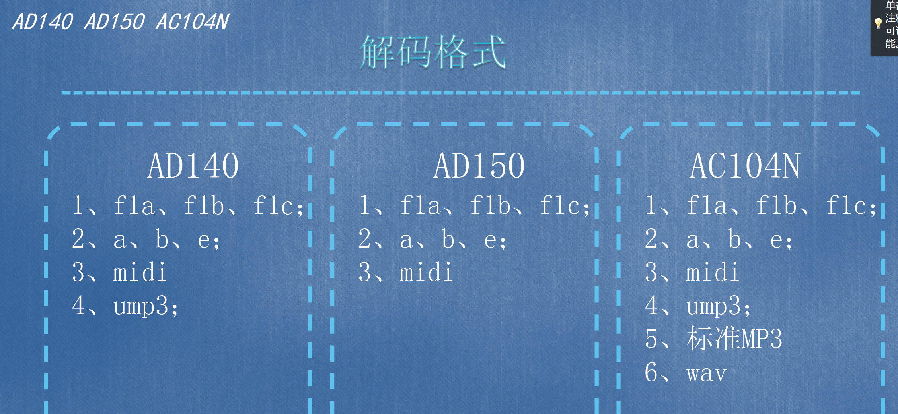
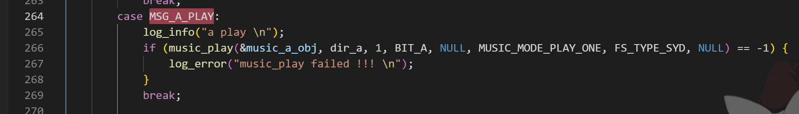
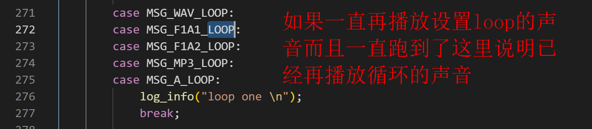
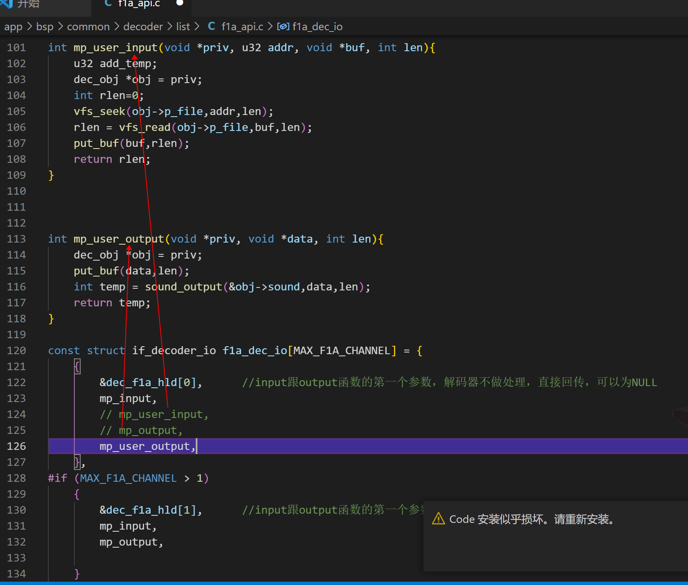
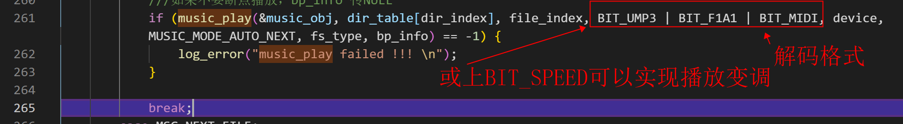
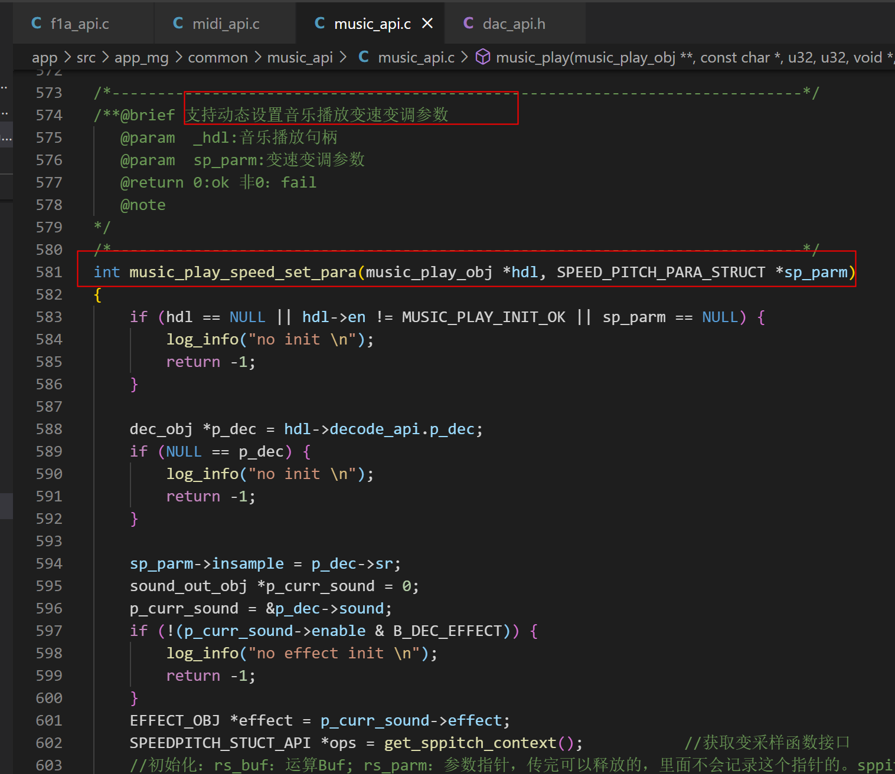

AD系列音乐模式说明
================

 新手请先仔细阅读SDK压缩包目录下的DOC文件夹里面的SDK手册和芯片手册!!!  
 
 开发中遇到任何问题请先到 <https://gitee.com/Jieli-Tech/fw-AD15N/issues> 查找是否有相关或类似问题的解决办法 !!! 
 
 

SDK默认开机进入音乐模式，如果初始化能找到设备而且能找到能播放的文件就会自动播放，找不到就会跳到下一个模式。先查看SDK手册第 3 4 5章的内容 
AD14 解码一般流程
 
* 初始化设备  app_device_ioctl
* 打开文件    musci_file_open_bydirindex
* 初始化DAC   decoder_init
* 开始解码    decoder_io
 
在AC104 AD14 15不同的SDK中可能函数名字或者封装接口有些不一样，但是基本流程都是一样的完成上面4个步骤就可以开始播放文件了。

# 各个芯片支持的格式
三个芯片根据不同的产品定位支持不同的播放格式，客户可以自己根据需求选择。
 

# 多通道解码

SDK支持多个通道同时解码：可以在播放F1A或者UMP3或者MIDI的时候同时再播放A文件。
比如SDK里面默认在播放F1A文件，只需要按照MSG_A_PLAY这个消息里面的处理直接播放A文件即可实现两个通道同时解码。
 

 

# 无限循环播放
SDK支持一个文件无缝循环播放，用来实现一个很短的文件播放很长时间的需求。最新的SDK只需要打开 MUSIC_LOOP_EN 这个宏然后设置循环的次数参数dl->loop = 0;
具体可以再代码里面搜索 MUSIC_LOOP_EN 这个宏包含了哪些内容。
注意：无缝循环这个不是随便拿一个文件都可以做到完全听不出播放间隔的,需要做一下几个步骤 
## 1 需要在音频文件切掉头尾最后能做到头尾能平滑衔接
## 2 在转换工具里面设置无缝循环播放，自己设置好阈值参数
## 3 如果做了上面两步还是能听到中间有一些间隔建议换一种采样率或者换一种格式试一下

 
 

# 断点
SDK里面默认支持断点播放和断点记忆只需要打开 MUSIC_BREAK_POINT_EN 这个宏即可。 
注意：虽然我们VM系统做了平衡擦写的操作但是还是不建议频繁记录断点（因为FLASH擦写寿命有限），写的太频繁可能会导致产品工作一段时间以后就无法正常工作了 

# 解码接口
下面以F1A解码接口为例 
mp_input 函数是解码器的文件传入接口，解码器从这里取数据，如果用户换掉这里的数据解码器就会播放替换的文件 

mp_user_output 函数是解码器的输出接口，解码器把传入的文件解码以后会调用这个函数把解码出来的数据传入DAC 可以直接保存这里的数据得到解码器解码的文件。 

 

# 文件变调播放

SDK里面的 AUDIO_SPEED_EN 控制可以实现播放的变调，只要在播放参数里面打开这个BIT即可。初始化效果参数可以在speed_api.c里面设置。
 

 
 
music_api.c里面有一个可以动态调整变调参数的接口 
 

