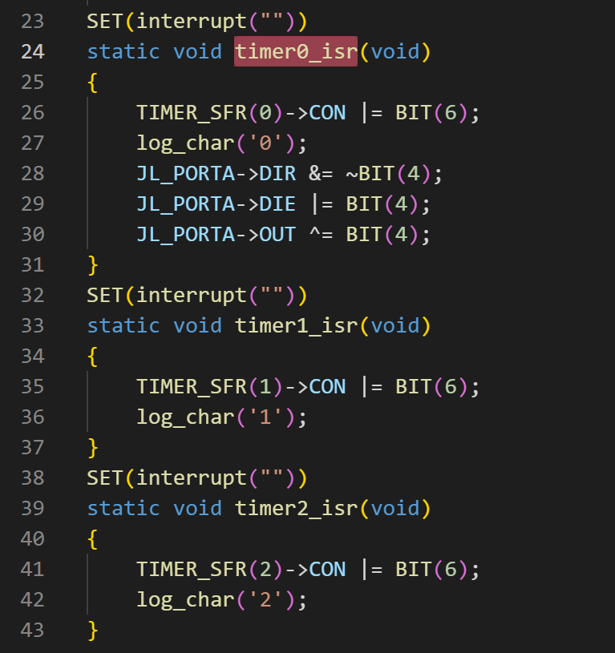

AD系列TIMERh和PWM说明
================

 新手请先仔细阅读SDK压缩包目录下的DOC文件夹里面的SDK手册和芯片手册!!!  
 
 开发中遇到任何问题请先到《https://gitee.com/Jieli-Tech/fw-AD15N/issues> 查找是否有相关或类似问题的解决办法 !!! 
 
 

芯片一共有3个TIMER 4路MCPWM先查看芯片手册第 10 11章的内容 
 

# TIMER timer_drv.c里面已经做好了timer的驱动，只需要调用初始化即可

void timer_init(u8 timer_ch, u32 us)  //第一个参数传入timer序号 第二个参数传入定时时间 
 
频率超过100的定时器中断响应函数建议都要放到RAM区域（如图中一样定义到指定区域），中断响应函数里面调用的函数也需要放到RAM区域。因为代码是存放在FLASH里面如果程序跑到了这里CPU才会把相应的代码读取到Cache里面，如果快速的中断里面的代码没有放到RAM区而是在普通区域程序运行过程中就需要非常频繁的从flash里面读取代码可能会导致莫名其妙的死机问题。 
 
 

# PWM AD系列支持两种PWM输出

## TIMER_PWM 只有TIMER2支持硬件PWM输出，输出IO可以remap到任意IO口 注意尽量用默认的PWM输出因为REMAP通道有限> 

使用TIMER2 的映射输出只要先调用SDK里面默认有的函数timer2_pwm_init 

然后再设置TIMER2PWM的映射输出通道即可实现gpio_output_channle(TIMER2_PWM_IO, CH0_T2_PWM_OUT0);//io选择--->设置输出通道 CH1_T2_PWM_OUT0 
使用输出通道0还是1 要根据情况自己选择芯片只有两个映射输出通道用掉了就没有了。 

## MCPWM 芯片自带4路MCPWM可独立调节占空比和频率，输出IO可以remap到任意IO口 注意尽量用默认的PWM输出因为REMAP通道有限> 

下面网盘链接提供了一个AD15的PWM输出到任意IO口只需要配置参数的DEMO

<https://pan.baidu.com/s/1g3g2FeQgwjQUQkRhpujybA> 
提取码：blcr