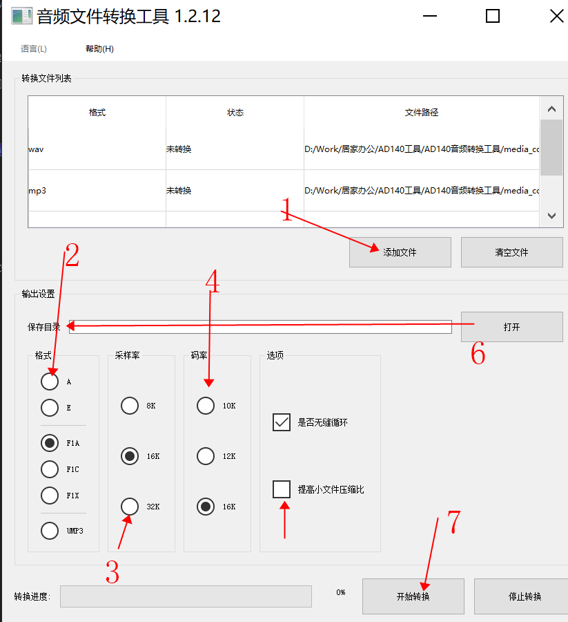
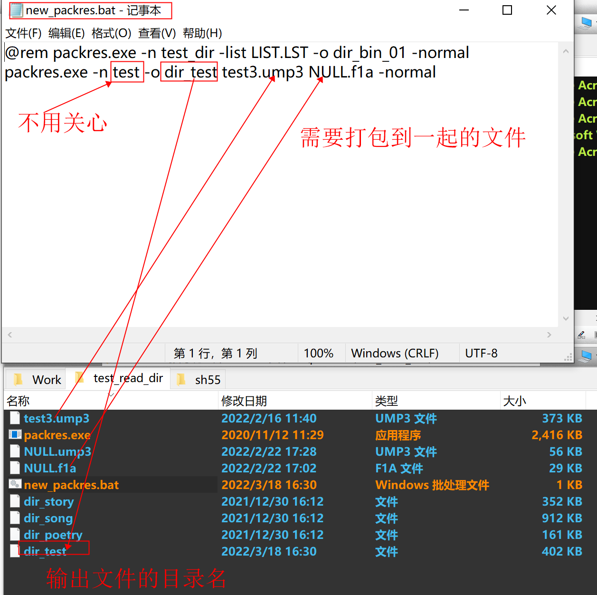

AD系列常用工具使用说明
================

 新手请先仔细阅读SDK压缩包目录下的DOC文件夹里面的SDK手册和芯片手册!!!  
 
 开发中遇到任何问题请先到 《https://gitee.com/Jieli-Tech/fw-AD15N/issues> 查找是否有相关或类似问题的解决办法 !!! 
 
 

AD系列常用工具网盘下载地址：<https://pan.baidu.com/s/1XvGlAYwAk_QYLAWi9QShtA> 提取码：qrj4
* 音频转换工具
* 文件打包工具
* midi转换工具
* MIO文件制作工具

# 音频转换工具
 
音频转换工具主要用来转换AD14 15播放的F1A UMP3 A等格式的文件，支持不同的采样率和码率，支持设置无缝循环头尾切帧。 

1. 选择添加文件 选中要转换的目录工具支持MP3 WAV WMA等格式不关心输入文件的采样率和码率
2. 选择要转换的格式A文件压缩率比较低解码资源用的少 F1A和UMP3压缩率高解码用的资源多 
3. 选择采样率 采样率越高占用空间越大
4. 选择码率 码率越大占用空间越大
5. 选择是否需要无缝循环播放 打开了这个选项工具会自动切除掉头尾（实际效果需要实测）
6. 选择保存的路径
7. 点击开始转换即可 
 

# 文件打包工具
文件打包工具是一个用来把很多需要播放的文件打包成一个文件方便在程序里面用目录播放下载的时候节省批处理字数的工具。 
注意需要把packres.exe  new_packres.bat 还有需要打包的音乐文件放到同一个目录下才可以正常打包 
 

# midi转换工具
关于AD14 15系列MIDI功能开发说明和midi工具使用说明可以自己去网盘下载 
<https://pan.baidu.com/s/1CuWa0Soi2KorDPvthJYIww>  提取码：mf13 

# MIO文件制作工具
 
工具里面自带有使用说明这里主要介绍这个工具的用途 
一些做玩具开发的客户可能用过在音频文件上打MARK点的功能，在文件播放到某个位置的时候可以执行相应的操作，比如拉高拉低某个IO。 
jl_mio工具就是用来实现类似的功能，工具里面导入一个芯片可以播放的音频文件然后在任意指定文件反转IO或者设置某个IO的PWM。最多支持4路PWM和16个IO口操作。 
对应程序里面的mio_api.c 注意查看SDK手册第 14章 内容。 

