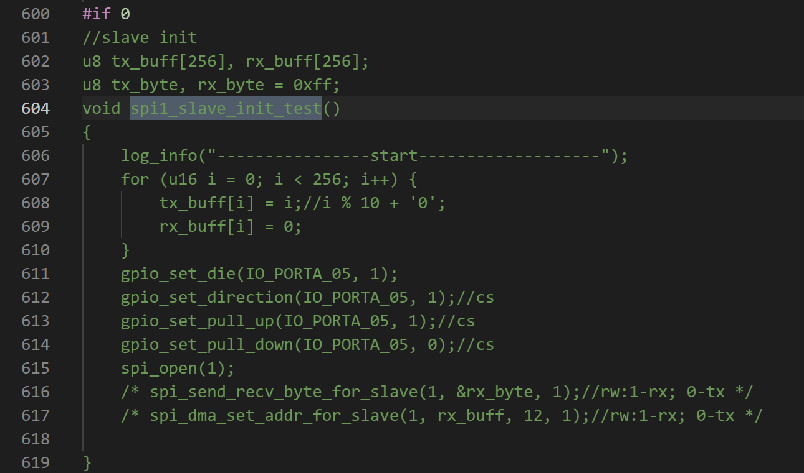
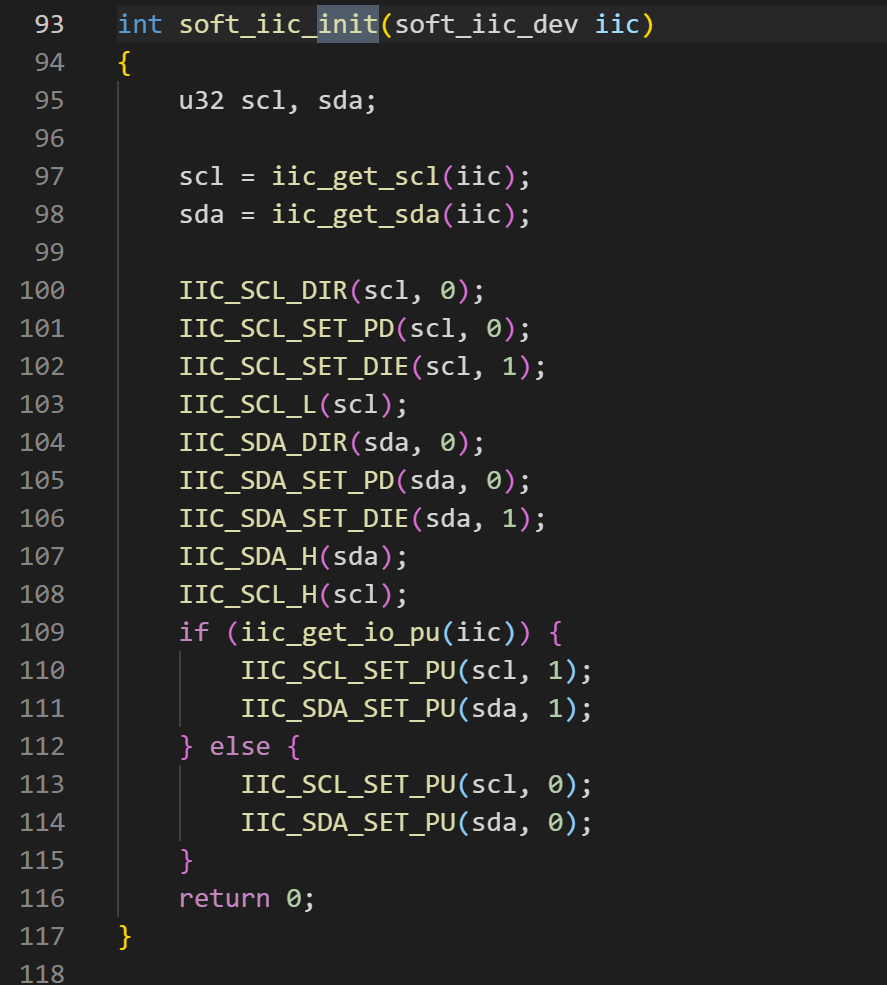

AD系列常用通信协议
================

 新手请先仔细阅读SDK压缩包目录下的DOC文件夹里面的SDK手册和芯片手册!!!  
 
 开发中遇到任何问题请先到 <https://gitee.com/Jieli-Tech/fw-AD15N/issues> 查找是否有相关或类似问题的解决办法 !!! 
 
 

这里主要介绍UART SPI IIC等常用的通信协议  

# UART
芯片一共有两个硬件UART模块，SDK里面默认用UART来打印调试会占用一个UART资源，还有一个可以用来做通信使用。 
SDK里面默认已经做好了串口收发相关驱动用户只需要调用初始化函数即可，看程序里面的注释和芯片手册可以设置串口功能。比如是否使用DMA收发 收发是否产生中断等功能。可以根据自己的需求修改这些设置。 
做好了一个AD15的串口收发的的DEMO，直接下载就可以用。[  _链接下载地址  ][串口demo超链] 提取码:e6pw  
SDK已经做好了任意IO口映射的功能，同样需要注意尽量使用默认的IO口。 
 
 

# SPI
芯片一共有两个硬件SPI模块，SPI0用来接跑代码的FLASH不能更改或者使用，还有一个SPI1可以给客户使用，比如用来接第二个FLASH用来存音频或者用来接其他SPI协议的外设  
spi1.c中已经做好了驱动，只需要打开对应的功能即可。做主机MASTER_DEMO 做从机SLAVE_DEMO。用客户自己对应芯片手册修改对应的寄存器来设置功能。
spi1_master_test  这个函数打开SPI主机功能，需要配合其他Spi从机设备测试。 
 

spi1_slave_init_test  这个函数打开SPI从机功能，需要配置其他SPI主机设备测试。 
 

# IIC
芯片有一个硬件IIC模块。SDK里面默认已经做好了硬件IIC的驱动iic_hw.c和软件模拟iic_soft.c。用户可以用hw_iic_cfg 结构体来配置IIC参数。 
调用hw_iic_init 既可打开硬件IIC功能。 
IIC 从机DEMO[ _链接下载地址 ][IIC-demo超链] 提取码:5xdr  
 
soft_iic_init 既可打开软件IIC功能。 
 

[串口demo超链]:https://pan.baidu.com/s/1BHh0zTS5u2edLHLgiMIjGw 
[IIC-demo超链]:https://pan.baidu.com/s/1FDmxbAxHMhWkL1qh0SpXNQ 

